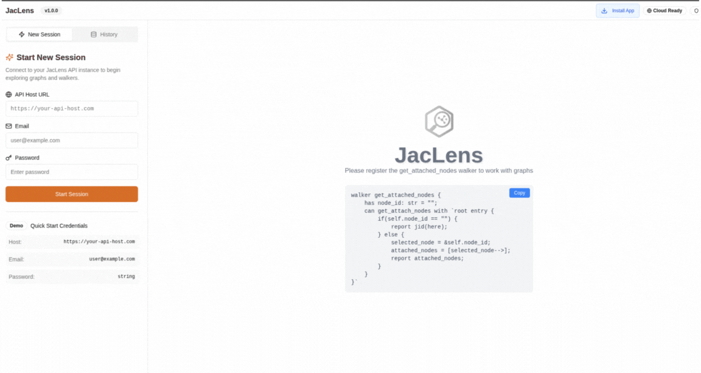
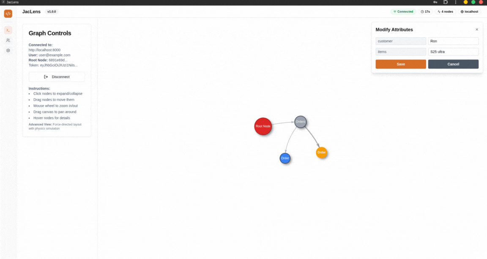

<div style="text-align: center; margin-bottom: 30px;">
    <!--  -->
    <h1 style="color: orange; font-weight: bold; margin: 0;">Jac Lens</h1>
    <h2 style="color: white; font-weight: 300; font-size: 1.2em; margin-top: 5px; margin-bottom: 0; opacity: 0.8;">Manage your jac cloud data at ease</h2>
</div>


Jac Lens is a powerful Progressive Web App (PWA) that provides an intuitive visual interface for exploring and managing your Jac graph data. It allows you to connect to your Jac server, navigate through node relationships, and modify node properties in real-time.

## Quick Start

### 1. Access the Application

- **URL**: https://jaclens.jaseci.org/
- **Browser**: Chrome recommended for optimal experience
- **Installation**: Follow browser prompts to install as a Progressive Web App (PWA)

<div class="grid cards" markdown>

-   __Install as PWA__

    ---

    *Get the full app experience*

    

-   __Connect to Server__

    ---

    *Link to your Jac instance*

    

-   __Explore Graph__

    ---

    *Navigate node relationships*

    

-   __Update Graph__

    ---

    *Navigate node relationships*

    

</div>

### 2. Installation Process

The Jac Lens PWA installation is straightforward:

1. **Open the URL** in Chrome browser
2. **Look for the install prompt** in the address bar or menu
3. **Click "Install"** to add to your home screen
4. **Launch from your apps** for a native experience

> **Note**
>
> Installing as a PWA provides offline capabilities and a more app-like experience.

## Setup for Jac Cloud (Pre-0.2.5)

If you're using Jac Cloud version prior to 0.2.5, you need to manually add the required walkers to your application.

### Required Walkers

Create a file named `jaclens.jac` with the following content:

```jac
walker get_attached_nodes {
    has node_id: str = "";
    can get_attach_nodes with `root entry {
        if(self.node_id == "") {
            report jid(here);
        } else {
            selected_node = &self.node_id;
            attached_nodes = [selected_node-->];
            report attached_nodes;
        }
    }
}

walker update_node_data {
    has node_id: str = "";
    has node_data: dict = {};
    can update_node_data with `root entry {
        selected_node = &self.node_id;
        selected_node.__dict__.update(self.node_data);
        report selected_node;
    }
}
```

### Integration Steps

1. **Create the file** `jaclens.jac` in your project
2. **Copy the walker code** above into the file
3. **Include in your main file** by adding `include jaclens;` at the top of your application entry JAC file

??? info "Why These Walkers?"
    These walkers provide the necessary functionality for Jac Lens to:
    - Retrieve node information and relationships
    - Update node properties in real-time
    - Navigate through your graph structure

## Using Jac Lens

### 1. Server Connection

Connect to your Jac server by providing:

- **Host URL**: Your Jac server address (remove trailing slash)
- **Email**: Your account email
- **Password**: Your account password

??? example "Example Connection"
    ```
    Host URL: https://my-jac-server.com
    Email: user@example.com
    Password: ********
    ```

### 2. Graph Navigation

Once connected, you can explore your graph:

- **Click on nodes** to view their properties
- **Navigate connections** between nodes
- **Zoom and pan** to explore large graphs
- **Search for specific nodes** using the search functionality

### 3. Node Management

Modify node properties directly in the interface:

- **Edit node attributes** in the side panel
- **Save changes** to update your server
- **View node relationships** and connections
- **Delete nodes** when needed

### 4. Session Management

Jac Lens automatically manages your sessions:

- **Automatic saving** of your current view
- **Session persistence** across browser sessions
- **Resume where you left off** when returning to the app

## Features Overview

<div class="grid cards" markdown>

-   __Real-time Updates__

    ---

    *See changes instantly*

    Changes made in Jac Lens are immediately reflected in your Jac server

-   __Graph Visualization__

    ---

    *Visual node relationships*

    Interactive graph view with zoom, pan, and node selection

-   __Property Editing__

    ---

    *Modify node attributes*

    In-place editing of node properties and metadata

-   __Search & Filter__

    ---

    *Find nodes quickly*

    Search functionality to locate specific nodes in large graphs

</div>

## Troubleshooting

### Common Issues

??? failure "Connection Failed"
    - Verify your server URL is correct
    - Ensure your credentials are valid
    - Host url doesn't have trailing slash
    - Check that your server is running and accessible


??? failure "Graph Not Loading"
    - Confirm you have the required walkers installed
    - Check your server logs for errors
    - Verify your graph has data to display

??? failure "Changes Not Saving"
    - Ensure you have write permissions
    - Check your network connection
    - Verify the update_node_data walker is working

### Getting Help

If you encounter issues not covered here:

1. **Check the browser console** for error messages
2. **Verify your Jac server logs** for backend errors
3. **Ensure you're using a compatible browser** (Chrome recommended)
4. **Contact the Jac community** for additional support

## Next Steps

<div class="grid cards" markdown>

-   __Explore Jac Cloud__

    ---

    *Scale your applications*

    [Jac Cloud Introduction](jac-cloud/introduction.md){ .md-button .md-button--primary }

-   __Learn Object-Spatial Programming__

    ---

    *Master Jac's core concepts*

    [Nodes and Edges](data_spatial/nodes_and_edges.md){ .md-button }

-   __Try the Playground__

    ---

    *Experiment with Jac*

    [Jac Playground](jac_playground.md){ .md-button .md-button--primary }

</div>
